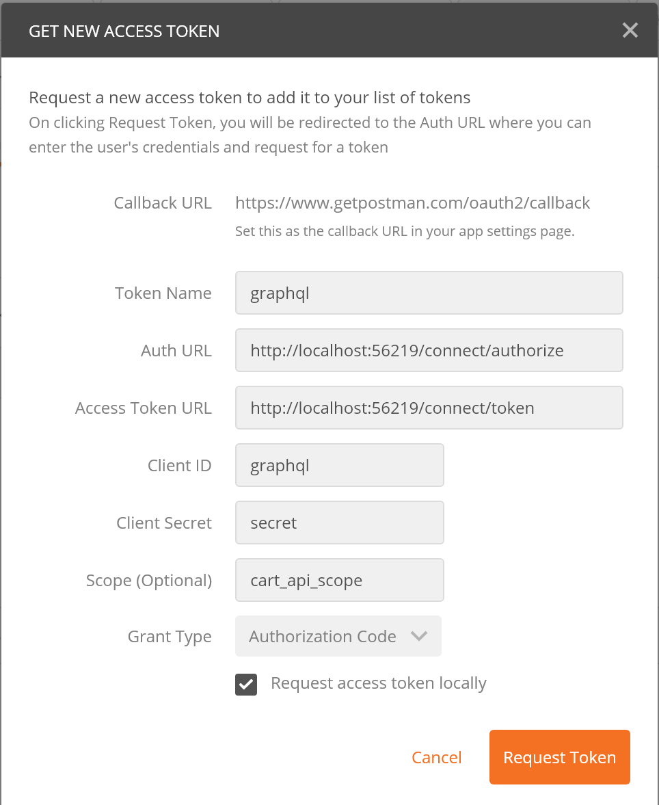

# Local Development Craftmanship

## NetCoreKit

All .NET microservices are developed by using [NetCoreKit](https://github.com/cloudnative-netcore/netcorekit) library. So we need to make it as a `submodule` in `coolstore-microservices` project.

### Add submodule

Run the command at the root of `coolstore-microservices` project as following

```
> git submodule add https://github.com/cloudnative-netcore/netcorekit src/netcorekit
```

It should create a file `.gitmodules` with the content as below

```
[submodule "src/netcorekit"]
	path = src/netcorekit
	url = https://github.com/cloudnative-netcore/netcorekit
	ignore = dirty
```

### Update submodule

To update the content from `NetCoreKit` project, run

```
> git submodule foreach git pull origin master
```

Reference at https://stackoverflow.com/questions/5828324/update-git-submodule-to-latest-commit-on-origin

## Identity Server

- IdentityServer4

### Postman



> TODO

### Open API

> TODO

### GraphQL Server

> TODO

### Front and Back Office Websites

> TODO

## gRPC Service

- Grpc
- Google.Protobuf
- Google.Api.Gax.Grpc

Before you can generate `gRPC` files for all microservices in this project you need to install some of tool as below

### Install `protoc-gen-swagger`

This will help to generate `Open Api` file (former is `Swagger`), and used in `./src/services/open-api` service

More information can be found at https://github.com/grpc-ecosystem/grpc-gateway

```bash
go get -u github.com/grpc-ecosystem/grpc-gateway/protoc-gen-swagger
```

At the root of each microservice, we put one `bash` script with named `cmd_gen_proto.sh` so that you can generate standalone `gRPC` files for each service, and if you want to generate `gRPC` files for all of them, then you can access and run at `./deploys/scripts/gen-protos.sh`

## Envoy Proxy

- envoy-proxy

> TODO

## Open Api

- Swashbuckle.AspNetCore.SwaggerUI

> TODO

## GraphQL Server

- tanka.graphql
- tanka.graphql.server
- GraphQL.Server.Ui.Playground
- GraphQL.Server.Ui.Voyager

> TODO

## Front and back office websites

### Front office website

- vuejs
- webpack

> TODO

### Back office website

- create-react-app
- apollo-client
- tanka-graphql-client

- At the root of `src/backoffice`, we create a `.env` with content as below

```
REACT_APP_GRAPHQL_ENDPOINT=http://localhost:5011
REACT_APP_AUTHORITY=http://localhost:56219
REACT_APP_ROOT_URL=http://localhost:3000
REACT_APP_CLIENT_ID=backoffice
```

This will point to the local graphql endpoint. When we deploy it to production, we will ovewrite it with another configuration

- Then we run `yarn start` to start development the `back-office` app
